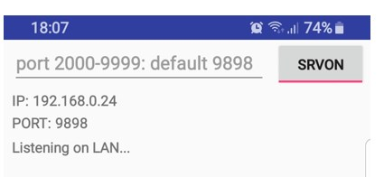

# Send SMS and Emails from Excel without expensive SMS gateways

## Introduction 

There is already plenty of available solutions that utilise MS Word
Plugins to connect to SMS gateway. These propositions are usually either
expensive or require installation of additional software, handling your
customer data.

## What it does?

This work attempts to initiate open-source local solution for small
businesses, that would allow for similar functionality for no extra cost
or contracts. Main concept is to run small java server on android
SMS-capable device, that is connected to by Excel spreadsheet running
automation macro. Running on the local network, and utilising only
readily available consumer hardware.

## Who is it for?

This is an alternative for SOHO businesses, and for small offices
utilising excel spreadsheets instead of databases. Although initially
only android devices are supported, with help of more contributors in
the future, database and platform support may be extended.

# Sending multiple SMS automatically

## Data source

Excel macro is capable to send multiple SMS based on configuration
provided through excel interface. As a data source, application requires
spreadsheet containing customer information including mobile phone
number, and any data specified as \<\<tags\>\> in message template and
added to tags list on configuration sheet.

## Step by Step process.

Figure 2.1.1. Configuration sheet.

Figure 2.1.2. Data source spreadsheet.

Figure 2.1.4. Initial app state.

Figure 2.1.5. Android App Server Started with default port.

Figure 2.1.6. Entering details on configuration spreadsheet and pressing
ok to test connection.

Figure 2.1.3. Message in Excel.

Figure 2.1.7. App Screen after connection test.

Figure 2.1.8.VBA form after pressing SEND SMS button.

Tags in the messages template are replaced with corresponding data from
data source spreadsheet. In case of message length extending the 160
characters limit, message is split. Report on this process, along with
cost calculation are available to check before sending.

Figure 2.1.9. Checking total cost of all messages.

Figure 2.1.10. Displaying ascii payload to be send to smartphone.

Figure 2.1.11. App receives the payload.

Figure 2.1.12. Sending Messages

Figure 2.1.13. Sending Messages 2.

Figure 2.1.14. Report generated after sending.

# Sending Batch Emails

## Step by Step process (missing screens)

In Case of Email messages, app uses templates written in MS Word. For
now, only docx format is supported. Macro opens multiple Outlook emails
with all fields automatically completed, ready to send.

Figure 2.1.16. Sending batch emails.

Figure 2.1.17. Example Email Template in a Word file.

Working Wi-Fi network and android device.
